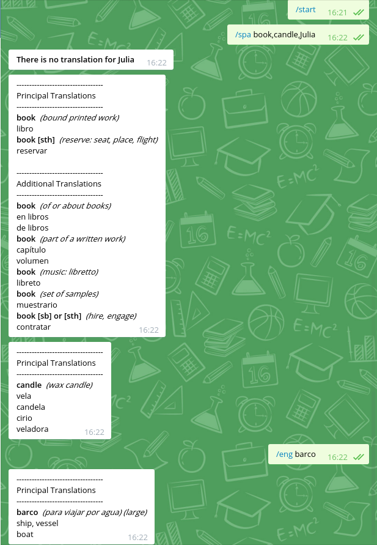
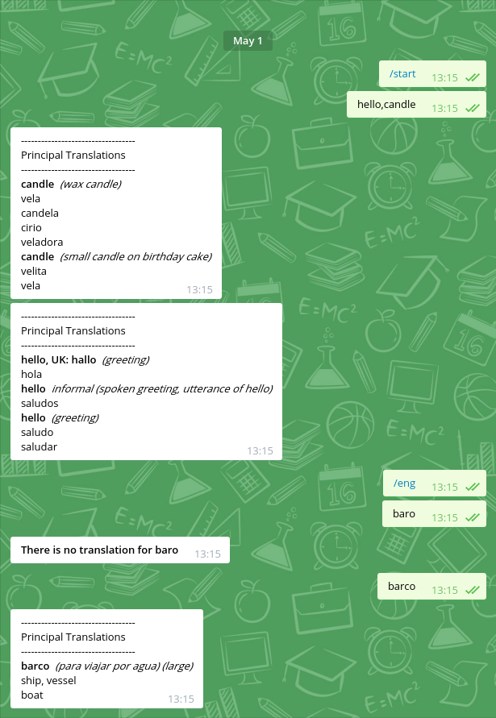

# wordReferenceBot

## Table of Contents
1. [Description](#description)
2. [Major update!](#major-update)
3. [Commands](#commands)
4. [Wrefbot web](#wrefbot-web)
5. [Screenshots](#screenshots)
6. [Documentation](#documentation)

## Description

This is a telegram bot made on Node.js for helping with translations.

I have trying to learn English on my own. But I need to translate a lot of new words and with this bot, it's extremely easy :)

Since wordreference's api is no longer available, I'm doing web scraping using [request](https://github.com/request/request) + [cheerio](https://github.com/cheeriojs/cheerio).

## Major update!

1. RegExp improved for groups.
2. Words are now stored in a MongoDB.
3. New web-endpoint with ejs (you can even query the database from there!).
4. Now using socket.io for knowing in real time the number of stored translations.
5. Highcarts for database usage! 
6. Logging with winston.
7. Moved to es6 syntax.


## Commands

```
Long usage mode:
/eng list,of,words: Translate TO English, the words separated by commas
/spa list,of,words: Translates TO Spanish, the words separated by commas
/help: Display help message

Short usage mode:
/spa: Activate mode eng -> spa
/eng: Activa mode spa-> eng
word,to,search for: translate words using the active mode
eng -> spa is active by default
```

## [Wrefbot web](https://wrefbot-aabreuglez.rhcloud.com/)

## Screenshots




## Documentation

For more info of everything that has struggled me:

- [Problems crawling wordreference](http://stackoverflow.com/questions/34860760/problems-crawling-wordreference)
- [Configure a telegram bot webhook into an existing express app](http://mvalipour.github.io/node.js/2015/12/06/telegram-bot-webhook-existing-express/)
- [Mongoose docs](https://mongoosejs.com/docs/guide.html)

 
